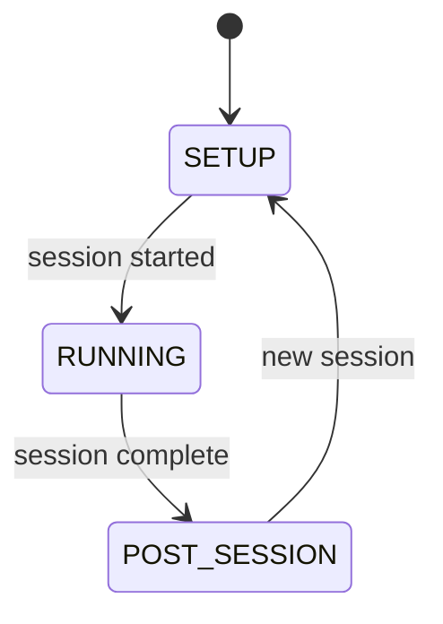

# GUI System

The GUI layer is built with [DearPyGui](https://github.com/hoffstadt/DearPyGui) and follows a strict "thin view" pattern: no business logic, only display and user input forwarding.

## Layout architecture

The application uses a VSCode-inspired single-viewport layout managed by `AppLayout`:

```
┌──┬────────────┬──────────────────────────────────────┐
│  │ Sidebar    │  Rig panels (horizontal, auto-scale) │
│AB│ panel      │  ┌──────────┬───┬──────────┐         │
│  │ (toggle)   │  │  Rig 1   │ | │  Rig 2   │         │
│  │            │  │          │ | │          │         │
│  │            │  └──────────┴───┴──────────┘         │
├──┴────────────┴──────────────────────────────────────┤
│ Info bar: clock | status                             │
└──────────────────────────────────────────────────────┘
```

| Component | DPG widget | Behaviour |
|-----------|-----------|-----------|
| Activity bar | `child_window(width=42)` | Fixed narrow column of icon buttons |
| Sidebar | `child_window(width=240)` | Toggleable panels: Rigs, Tools, Post-Processing, Docs |
| Main content | `child_window(width=-1)` | Horizontal group of rig panels, auto-scaling widths |
| Info bar | `child_window(height=28)` | Pinned at bottom, clock + status text |
| Menu bar | `menu_bar` | Preferences > UI Scale |

### Sidebar toggle

Clicking an activity bar icon toggles the sidebar:

- Click icon → show that panel (hide others)
- Re-click same icon → collapse sidebar entirely
- Click different icon → switch panel content

When the sidebar shows/hides, rig panel widths recalculate to fill the available space.

### Rig panels

Rigs open as side-by-side panels (not tabs) in a horizontal group. Panel widths are calculated as:

```
panel_width = (viewport_width - activity_bar - sidebar - padding) / num_panels
```

This recalculates on viewport resize and sidebar toggle.

## Window modes

Each rig panel contains a `RigWindow` that manages three mutually exclusive mode views:



| Mode | Class | When shown |
|------|-------|------------|
| `SETUP` | `SetupMode` | Configuring session parameters |
| `RUNNING` | `RunningMode` | Protocol executing, live monitoring |
| `POST_SESSION` | `PostSessionMode` | Results after session ends |

Mode switching is handled by `RigWindow._show_mode()` which hides the current mode group and shows the new one.

## RigWindow responsibilities

The `RigWindow` is a thin orchestrator that builds its content inside a parent container (the rig panel):

1. **Create mode views** — Instantiates SetupMode, RunningMode, PostSessionMode
2. **Create SessionController** — The controller has no GUI dependency
3. **Bind events** — Registers controller event callbacks with thread marshalling
4. **Switch modes** — Responds to controller lifecycle events by swapping visible views

### Thread marshalling

All controller events arrive on background threads. The RigWindow wraps every callback with `call_on_main_thread()` to schedule execution on the DPG render thread:

```python
def _bind_controller_events(self):
    def on_main_thread(fn):
        def wrapper(**kwargs):
            call_on_main_thread(fn, **kwargs)
        return wrapper

    self.controller.on("startup_status", on_main_thread(self._on_startup_status))
    self.controller.on("protocol_log", on_main_thread(self._on_log))
    self.controller.on("performance_update", on_main_thread(self._on_perf_update))
    # ... etc
```

The `call_on_main_thread()` function appends to a thread-safe deque that is drained each frame in the manual render loop (`dpg_app.py`).

## Render loop

DearPyGui uses a manual render loop instead of an event-driven mainloop:

```python
while dpg.is_dearpygui_running():
    # Drain thread-safe callback queue
    while _callback_queue:
        fn, kwargs = _callback_queue.popleft()
        fn(**kwargs)

    # Time-based polling (scales, virtual rig, clock, panel resize)
    frame_poller.tick()

    dpg.render_dearpygui_frame()
```

The `FramePoller` replaces tkinter's `after()` — it checks registered callbacks against their intervals each frame and fires them when due. `call_later(delay_ms, fn)` provides one-shot delayed execution.

## Setup mode

The setup mode contains:

- **Save Location** — combo dropdown to select cohort folder
- **Mouse ID** — combo dropdown with auto-cohort switching
- **Session Parameters** — mouse weight, trial count, max duration
- **Protocol Selection** — combo dropdown that shows/hides per-protocol parameter forms
- **Start Session** button (pinned at bottom)

### Parameter widget system

The GUI dynamically generates input forms from protocol parameter definitions using `ParameterFormBuilder`.

| Parameter type | DPG widget |
|---------------|-----------|
| `IntParameter` | `add_input_int` |
| `FloatParameter` | `add_input_float` |
| `BoolParameter` | `add_checkbox` |
| `ChoiceParameter` | `add_combo` |
| `StringParameter` | `add_input_text` |

Labels appear above their input widgets (not beside) for compact layout. All inputs use `width=-1` to fill available width. Descriptions use `wrap=0` for automatic text wrapping.

## Running mode

The running mode displays session data in vertically stacked, resizable sections:

1. **Session** — protocol name, mouse ID, save path (fixed height)
2. **Trial Log** — colored trial outcomes (resizable)
3. **Scales** — live weight plot with DPG native plotting (resizable)
4. **Performance** — tracker stats selected via combo dropdown, sub-trackers via tabs (resizable)
5. **Session Log** — timestamped messages (fills remaining space)
6. **Action bar** — timer, status, DAQ View button, Stop button (pinned at bottom)

Sections with `resizable_y=True` can be dragged to redistribute vertical space.

## Startup overlay

During the startup sequence, a modal `StartupOverlay` window covers the viewport:

- Animated progress bar
- Status messages and timestamped log
- Cancel button to abort startup
- Automatically hidden when `startup_complete` event fires

## Rig launcher (sidebar)

The Rigs sidebar panel:

1. Shows toggle buttons for each configured rig
2. Click to select/deselect rigs for launch
3. **Launch Selected Rigs** button tests connections and opens panels
4. Rigs launched together share a `multi_session_folder` timestamp
5. Tracks claimed mouse IDs across open rigs to prevent duplicate assignments

## Theme and palettes

The `theme.py` module provides consistent styling via a palette system:

- A `ColorPalette` named tuple defines all colours (37 fields) for the GUI
- Eight built-in palettes: `light`, `dark`, `dark_green`, `dark_red`, `dark_bw`, `dark_magenta`, `light_pink`, `boring`
- The active palette is selected via `global.palette` in `rigs.yaml`
- `apply_theme()` creates DPG theme objects (global, button variants, layout components) and loads bundled fonts
- Fonts are loaded at 2x target size and scaled down via `set_global_font_scale(0.5)` for sharp rendering on high-DPI displays
- Bundled fonts in `gui/fonts/`: Segoe UI, Consolas, Lucida Console, Old English Text MT

### Palette design rules

1. 3-tier background depth: `bg_primary` (deepest) < `bg_secondary` (panels) < `bg_tertiary` (inputs)
2. `text_primary` must be legible on all 3 background tiers
3. `text_inverse` must be legible on `accent_primary` (used for button labels on bright buttons)
4. For monochrome themes, accent colors are darker than text colors so `text_inverse` (dark) provides contrast

## Icon system

The `IconRegistry` creates placeholder icon textures programmatically as RGBA bitmaps. Custom icons can be loaded via `load_custom_icon(name, image_path)` for future customization.

## Welcome view

When no rigs are open, the main content area shows a welcome view with:

- Full-area generative art background (randomly chosen from 11 generators)
- Floating text card with title and instructions (uses real DPG fonts, not draw_text)
- Scales with viewport size and UI scale changes
