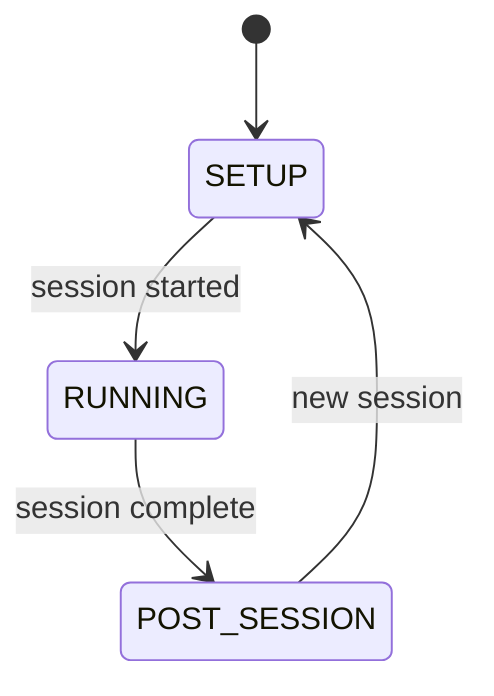

# GUI System

The GUI layer is built with tkinter and follows a strict "thin view" pattern: no business logic, only display and user input forwarding.

## Window modes

The `RigWindow` manages three mutually exclusive mode frames:



| Mode | Frame class | When shown |
|------|-------------|------------|
| `SETUP` | `SetupMode` | Configuring session parameters |
| `RUNNING` | `RunningMode` | Protocol executing, live monitoring |
| `POST_SESSION` | `PostSessionMode` | Results after session ends |

Mode switching is handled by `RigWindow._set_mode()` which hides the current frame and shows the new one. Only one mode is visible at a time.

## RigWindow responsibilities

The `RigWindow` is a thin orchestrator:

1. **Create mode frames** -- Instantiates SetupMode, RunningMode, PostSessionMode
2. **Create SessionController** -- The controller has no tkinter dependency
3. **Bind events** -- Registers controller event callbacks with thread marshalling
4. **Switch modes** -- Responds to controller status changes by swapping visible frames

### Thread marshalling

All controller events arrive on background threads. The RigWindow wraps every callback with `root.after(0, fn)` to schedule execution on the tkinter main thread:

```python
def _bind_controller_events(self):
    def on_main_thread(fn):
        def wrapper(**kwargs):
            self.root.after(0, lambda: fn(**kwargs))
        return wrapper

    self.controller.on("startup_status", on_main_thread(self._on_startup_status))
    self.controller.on("protocol_log", on_main_thread(self._on_log))
    self.controller.on("performance_update", on_main_thread(self._on_perf_update))
    # ... etc
```

This is the **only place** in the codebase where cross-thread GUI marshalling happens.

## Parameter widget system

The GUI dynamically generates input forms from protocol parameter definitions.

### ParameterFormBuilder

```python
builder = ParameterFormBuilder(parent_frame, parameters)
builder.build()   # Create widgets
builder.pack()    # Layout in parent

# Later:
is_valid, errors = builder.validate()          # Dict[name, error_msg]
values = builder.get_converted_values()        # Dict[name, typed_value]
builder.reset_to_defaults()
```

### Widget mapping

| Parameter type | Widget class | Tkinter widget |
|---------------|-------------|----------------|
| `IntParameter` | `IntParameterWidget` | `Spinbox` |
| `FloatParameter` | `FloatParameterWidget` | `Spinbox` |
| `BoolParameter` | `BoolParameterWidget` | `Checkbutton` |
| `ChoiceParameter` | `ChoiceParameterWidget` | `Combobox` |
| `StringParameter` | `StringParameterWidget` | `Entry` |

Each widget handles its own validation, value extraction, and reset-to-default. The builder organizes widgets by `group` with section headings.

## Protocol tab generation

SetupMode auto-generates tabs from discovered protocols:

1. `get_available_protocols()` scans the `protocols/` directory for `BaseProtocol` subclasses
2. For each protocol class, a `ProtocolTab` frame is created
3. Each tab contains the protocol description and a `ParameterFormBuilder` for its parameters
4. The user selects a tab, fills in parameters, and clicks Start

## Startup overlay

During the startup sequence, a `StartupOverlay` covers the RigWindow:

- Semi-transparent overlay with status messages
- Cancel button to abort startup
- Automatically hidden when `startup_complete` event fires
- Shows error message on `startup_error`

## Launcher

The `RigLauncher` window:

1. Reads rig definitions from `rigs.yaml`
2. Loads the palette from `global.palette` in the config (falls back to `boring` if unknown)
3. Displays a clock, date, and a randomly generated decorative background (`launcher_background.py`)
4. Shows rig toggle buttons in a 2×2 grid for selecting which rigs to launch
5. **Launch Selected** opens a `RigWindow` (separate `Toplevel`) for each selected rig
6. Utility buttons: **Zero All Scales**, **Post Processing**, **Mock Rig**, and **Docs**
7. "Link Sessions" checkbox creates a shared `multi_session_folder` for all rigs opened together
8. Tracks claimed mouse IDs across open rig windows to prevent duplicate assignments

## Theme and palettes

The `theme.py` module provides consistent styling via a palette system:

- A `ColorPalette` named tuple defines all colours, fonts, and accent tones for the GUI
- Eight built-in palettes: `light`, `dark`, `dark_green`, `dark_red`, `dark_bw`, `dark_magenta`, `light_pink`, `boring`
- The active palette is selected via `global.palette` in `rigs.yaml` and applied at launcher startup
- `Theme.set_palette()` updates the class-level palette reference; all subsequent `Theme.font()`, `Theme.font_mono()`, and `Theme.font_special()` calls use the new palette's font families
- `get_accuracy_color(accuracy)` returns a color gradient from red (0%) through yellow (50%) to green (100%)
- Generative background art (`launcher_background.py`) derives its line colours from the active palette's accent colours
