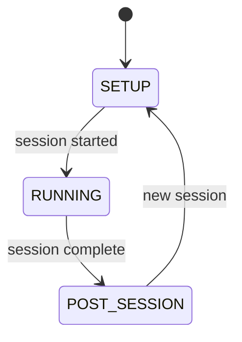

# GUI System

The GUI layer is built with DearPyGui and follows a VSCode-style layout. It maintains a strict "thin view" pattern: no business logic, only display and user input forwarding.

## Layout structure

`AppLayout` manages the top-level layout, organizing the window into:

- **Activity bar** -- Vertical icon strip on the far left for switching between sidebar panels
- **Sidebar** -- Collapsible panel next to the activity bar for rig selection, tools, and utilities
- **Horizontal rig panels** -- The main content area where each open rig gets a horizontal panel
- **Info bar** -- Status strip at the bottom of the window

## Window modes

Each `RigWindow` builds its content inside its parent container and uses `show()`/`hide()` to switch between three mutually exclusive modes:



| Mode | When shown |
|------|------------|
| `SETUP` | Configuring session parameters |
| `RUNNING` | Protocol executing, live monitoring |
| `POST_SESSION` | Results after session ends |

Mode switching uses `show()`/`hide()` so that only one mode is visible at a time.

## Thread marshalling

All controller events arrive on background threads. The GUI marshals them to the DearPyGui render loop using `call_on_main_thread()` and a callback queue:

```python
def _bind_controller_events(self):
    def on_main_thread(fn):
        def wrapper(**kwargs):
            call_on_main_thread(lambda: fn(**kwargs))
        return wrapper

    self.controller.on("startup_status", on_main_thread(self._on_startup_status))
    self.controller.on("protocol_log", on_main_thread(self._on_log))
    self.controller.on("performance_update", on_main_thread(self._on_perf_update))
    # ... etc
```

This is the **only place** in the codebase where cross-thread GUI marshalling happens.

## FramePoller

`FramePoller` provides periodic update callbacks for components that need to refresh on a regular cadence (e.g. elapsed time display, scales readings). It hooks into the DearPyGui render loop to call registered functions at a configured interval.

## Setup Mode

Setup Mode uses combo dropdowns for:

- **Cohort folder** -- Select the save location from folders defined in `rigs.yaml`
- **Mouse ID** -- Select the mouse from IDs defined in `rigs.yaml`
- **Protocol selection** -- Choose from discovered protocols, each with its own parameter form

### Parameter widget system

The GUI dynamically generates input forms from protocol parameter definitions using `ParameterFormBuilder`. Each parameter type maps to a DearPyGui widget:

| Parameter type | DearPyGui widget |
|---------------|-----------------|
| `IntParameter` | Input int with min/max |
| `FloatParameter` | Input float with min/max |
| `BoolParameter` | Checkbox |
| `ChoiceParameter` | Combo dropdown |
| `StringParameter` | Input text |

Each widget handles its own validation, value extraction, and reset-to-default. The builder organizes widgets by `group` with section headings.

## Running Mode

Running Mode has resizable sections for:

- **Session summary** -- Protocol name, mouse ID, save path, elapsed time
- **Performance display** -- Real-time statistics with a combo dropdown for tracker selection when the protocol declares multiple trackers
- **Trial log** -- Scrolling log of trial outcomes and protocol messages
- **Scales plot** -- Live weight reading rendered as a native DearPyGui plot

### Stop button

Sends a stop request to the protocol. The protocol checks `self.check_stop()` on its next iteration and exits gracefully.

## Startup overlay

During the startup sequence, a `StartupOverlay` covers the RigWindow:

- Semi-transparent overlay with status messages
- Cancel button to abort startup
- Automatically hidden when `startup_complete` event fires
- Shows error message on `startup_error`

## Font rendering

Fonts are loaded at 2x their target size and scaled down by 0.5 for sharp, high-DPI rendering. This avoids blurry text on scaled displays.

## Theme and palettes

The `theme.py` module provides consistent styling via a palette system:

- Eight built-in palettes: `light`, `dark`, `dark_green`, `dark_red`, `dark_bw`, `dark_magenta`, `light_pink`, `boring`
- The active palette is selected via `global.palette` in `rigs.yaml`
- A 3-tier depth design system organizes UI elements into background, surface, and foreground layers for visual hierarchy
- `get_accuracy_color(accuracy)` returns a color gradient from red (0%) through yellow (50%) to green (100%)
