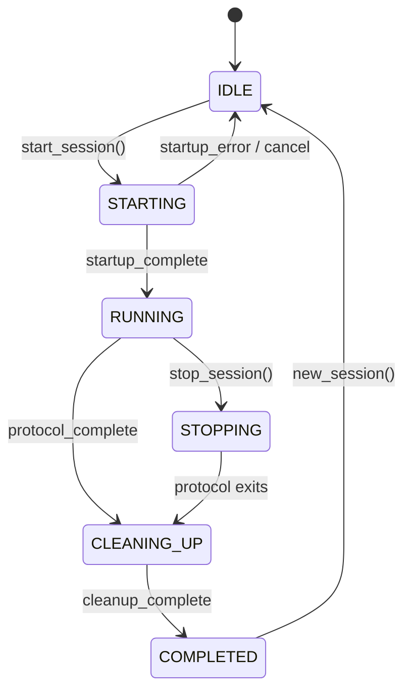

# Session Lifecycle

The `SessionController` manages the complete lifecycle of an experiment session through a state machine.

## Session states



| State | Description | Thread |
|-------|-------------|--------|
| `IDLE` | Setup Mode displayed. Waiting for user to configure and start | Main |
| `STARTING` | Startup sequence running. Overlay shown | Background |
| `RUNNING` | Protocol executing. Running Mode shown | Protocol thread |
| `STOPPING` | Stop requested. Waiting for protocol to check `check_stop()` | Protocol thread |
| `CLEANING_UP` | Hardware shutdown in progress | Cleanup thread |
| `COMPLETED` | Post-Session Mode shown. Results displayed | Main |

## Startup sequence

When the user clicks Start, `controller.start_session(config)` spawns a background thread that executes:

1. **Create session folder** -- Timestamped subfolder inside the selected cohort directory
2. **Load peripheral config** -- Build `PeripheralConfig` from rig settings
3. **Create BehaviourClock** -- If simulation mode with time acceleration
4. **Create VirtualRigState** -- If simulation mode
5. **Create PeripheralManager** -- Manages DAQ, camera, and scales subprocesses
6. **Start DAQ** -- Launch DAQ subprocess
7. **Wait for DAQ connection** -- Poll for signal file (up to `connection_timeout` seconds)
8. **Start camera** -- Launch camera executable with session arguments
9. **Start scales** -- Launch scales server subprocess, connect client
10. **Open serial port** -- Connect to behaviour Arduino (or create MockSerial for simulation)
11. **Reset Arduino** -- DTR pin toggle + startup wait
12. **Create BehaviourRigLink** -- Or SimulatedRig for simulation
13. **Handshake** -- `send_hello()` / `wait_hello()` with 3-second timeout
14. **Write metadata** -- Save session configuration as JSON
15. **Create protocol instance** -- Instantiate the selected protocol class with parameters
16. **Create performance trackers** -- One per `TrackerDefinition` from the protocol
17. **Wire events** -- Connect protocol and tracker events to controller events
18. **Set runtime context** -- Attach scales, trackers, rig number, clock, reward durations to the protocol
19. **Emit `startup_complete`** -- GUI switches from overlay to Running Mode

If any step fails, the controller emits `startup_error` with the error message and reverts to IDLE.

## Protocol execution

After startup completes, `controller.run_protocol()` spawns the protocol thread:

1. Set status to `RUNNING`
2. Call `protocol.run()` which executes:
    - `_setup()` (if overridden)
    - `_run_protocol()` (main experiment loop)
    - `_cleanup()` (always runs, even on error/stop)
3. Gather performance reports from all trackers
4. Save merged trial data as CSV
5. Build `SessionResult` with status, reports, and elapsed time
6. Emit `protocol_complete` with the result

## Stop handling

When the user clicks Stop:

1. `controller.stop_session()` sets status to `STOPPING`
2. `protocol.request_stop()` sets the internal `_stop_requested` flag
3. The protocol checks `self.check_stop()` in its next loop iteration
4. `check_stop()` returns `True`, the protocol returns early
5. `_cleanup()` runs (always)
6. Flow continues to protocol completion and cleanup

## Cleanup sequence

After the protocol finishes (success, stop, or error):

1. Set status to `CLEANING_UP`
2. Spawn cleanup thread:
    - Send `shutdown()` command to BehaviourRigLink
    - Close serial port
    - Stop PeripheralManager (DAQ, camera, scales subprocesses)
3. Emit `cleanup_log` messages for each step
4. Emit `cleanup_complete`
5. Set status to `COMPLETED`
6. GUI switches to Post-Session Mode

## SessionResult

The result object passed to the GUI after protocol completion:

```python
@dataclass
class SessionResult:
    status: str              # "completed", "stopped", or "error"
    elapsed_time: float      # Total session duration in seconds
    save_path: str           # Path to session folder
    performance_reports: dict # {tracker_name: report_dict}
    error_message: str       # Error details (if status == "error")
```

## New session

When the user clicks New Session in Post-Session Mode:

1. `controller.new_session()` resets internal state
2. Status returns to `IDLE`
3. GUI switches to Setup Mode with the previous configuration preserved
