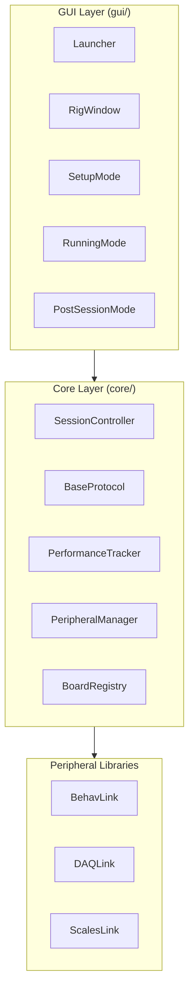
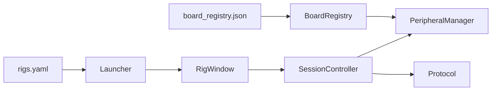

# System Overview

## Three-layer architecture

The system is organised into three layers with strict dependency rules:



### Layer rules

1. **GUI layer** (`gui/`) -- Contains all DearPyGui code. No business logic. Displays data from the core layer and forwards user actions. Depends on the core layer but the core layer **never imports from GUI**.

2. **Core layer** (`core/`) -- Contains all business logic: session management, protocol execution, performance tracking, hardware orchestration. Has no GUI dependency. Communicates with the GUI via named events.

3. **Peripheral libraries** (`BehavLink/`, `DAQLink/`, `ScalesLink/`) -- Independent packages for hardware communication. Usable outside the GUI application. No dependency on the core or GUI layers.

This layering prevents circular dependencies and ensures the core logic can be tested without a GUI.

## Event-driven communication

Layers communicate through a simple event pattern:

```python
# Core layer emits events
class SessionController:
    def _emit(self, event_name: str, **kwargs):
        for cb in self._listeners.get(event_name, []):
            cb(**kwargs)

# GUI layer subscribes
controller.on("protocol_log", self._on_protocol_log)
controller.on("performance_update", self._on_performance_update)
```

The core layer fires events on background threads. The GUI layer marshals them to the DearPyGui render loop:

```python
def on_main_thread(fn):
    def wrapper(**kwargs):
        call_on_main_thread(lambda: fn(**kwargs))
    return wrapper

controller.on("protocol_log", on_main_thread(self._on_protocol_log))
```

This pattern keeps the core layer unaware of DearPyGui while ensuring thread safety.

## Key events

| Event | Source | Data | Purpose |
|-------|--------|------|---------|
| `startup_status` | SessionController | `message` | Progress updates during startup |
| `startup_complete` | SessionController | (session payload) | Startup phase finished — GUI calls `run_protocol` next |
| `startup_error` | SessionController | `message` | Startup failed |
| `startup_cancelled` | SessionController | -- | User cancelled during startup |
| `protocol_log` | BaseProtocol | `message` | Protocol log messages |
| `performance_update` | PerformanceTracker | `tracker_groups`, `updated` | Trial outcome recorded |
| `stimulus` | PerformanceTracker | `port` | Stimulus presented |
| `protocol_complete` | SessionController | `final_status` | Protocol phase finished — GUI calls `finalize_protocol` next |
| `finalize_complete` | SessionController | `result` | `SessionResult` built — GUI calls `cleanup_session` next |
| `cleanup_log` | SessionController | `message` | Hardware shutdown messages |
| `cleanup_complete` | SessionController | -- | All hardware shut down — GUI shows Post-Session Mode |

## Configuration flow



1. `main.py` loads paths to `rigs.yaml` and `board_registry.json`
2. The Launcher reads rig definitions from YAML
3. When a rig is opened, the RigWindow creates a SessionController
4. On session start, the controller uses BoardRegistry to resolve board names to COM ports
5. PeripheralManager uses the resolved ports to start DAQ, camera, and scales subprocesses
