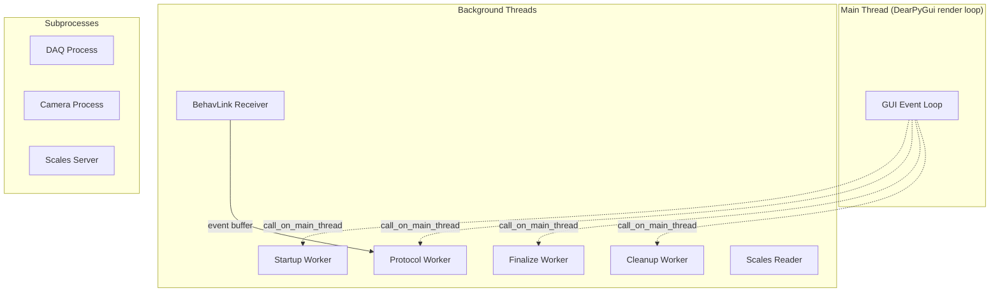

# Threading Model

The system uses multiple threads to keep the GUI responsive while running blocking operations. This page documents every thread, why it exists, and how they communicate safely.

## Thread inventory



Each lifecycle worker is **short-lived** and does **one phase only**. When its phase finishes, the worker emits a single `*_complete` event and exits. The GUI listener for that event triggers the next phase by calling the next public method on the controller, which spawns the next worker.

### Main thread

**Owner:** DearPyGui render loop

**Responsibilities:**

- All GUI rendering and widget updates
- User input handling
- Event dispatch from `call_on_main_thread()` callbacks

**Rule:** No blocking operations. No serial I/O. No subprocess management. Everything that blocks goes on a background thread.

### Startup worker

**Created by:** `SessionController.start_session()`

**Lifetime:** From Start button click to startup complete/error/cancelled

**Does:**

- Opens serial ports
- Resets Arduino via DTR
- Launches DAQ, camera, scales subprocesses
- Performs BehavLink handshake
- Creates protocol and tracker instances

**Exits after emitting:** `_emit("startup_complete")`, `_emit("startup_error")`, or `_emit("startup_cancelled")`. Streams `_emit("startup_status")` while running.

### Protocol worker

**Created by:** `SessionController.run_protocol()` (called from the GUI's `_on_startup_complete` listener)

**Lifetime:** From startup complete to protocol finish

**Does:**

- Executes `protocol.run()` (`_setup` -> `_run_protocol` -> `_cleanup`)
- All trial logic, hardware commands, and performance recording
- Captures the final `ProtocolStatus`

**Exits after emitting:** `_emit("protocol_complete", final_status=...)`. Streams `protocol._emit("log")`, `tracker._emit("update")`, `tracker._emit("stimulus")` while running. Does **not** chain into the next phase itself.

### Finalize worker

**Created by:** `SessionController.finalize_protocol()` (called from the GUI's `_on_protocol_complete` listener)

**Lifetime:** Brief -- result building only

**Does:**

- Gathers performance reports from every tracker group
- Saves the merged trial CSV to the session folder
- Builds the `SessionResult`

**Exits after emitting:** `_emit("finalize_complete", result=...)`.

### Cleanup worker

**Created by:** `SessionController.cleanup_session()` (called from the GUI's `_on_finalize_complete` listener, or by `controller.close()` on window close)

**Lifetime:** Brief -- hardware shutdown only

**Does:**

- Sends `shutdown()` to BehaviourRigLink
- Closes serial port
- Stops PeripheralManager (DAQ, camera, scales)

**Exits after emitting:** `_emit("cleanup_complete")`. Streams `_emit("cleanup_log")` (forwarded from PeripheralManager) while running.

### BehavLink receiver thread

**Created by:** `BehaviourRigLink.start()`

**Lifetime:** From link start to link stop

**Does:**

- Continuously reads frames from the serial port
- Parses incoming messages (ACKs, sensor events, GPIO events)
- Places ACKs in a threading queue for command retry logic
- Places events in deque buffers for `wait_for_event()` to consume
- Uses `threading.Condition` to wake `wait_for_event()` when events arrive

**Named:** `"BehaviourRigReceiver"` (daemon thread)

### Scales reader thread

**Created by:** `Scales.start()` (inside the ScalesServer subprocess)

**Lifetime:** While scales are active

**Does:**

- Continuously reads from the serial port
- Parses wired/wireless messages
- Updates the cached weight value (thread-safe via lock)

## Thread safety mechanisms

### `call_on_main_thread(fn)` -- GUI marshalling

All controller events fire on background threads. The RigWindow wraps callbacks to schedule them on the main thread:

```python
call_on_main_thread(lambda: self._on_protocol_log(message=msg))
```

This is the **single marshalling point** for all cross-thread GUI updates.

### Threading locks

| Lock | Location | Protects |
|------|----------|----------|
| Event buffer lock | BehaviourRigLink | Sensor/GPIO event deques |
| ACK queue lock | BehaviourRigLink | Command acknowledgement tracking |
| Weight lock | Scales | Cached weight value |
| State lock | VirtualRigState | All simulated hardware state |
| Dirty flag | VirtualRigState | Snapshot change tracking |

### Threading conditions

| Condition | Location | Purpose |
|-----------|----------|---------|
| Event condition | BehaviourRigLink | Wakes `wait_for_event()` when event arrives |
| Sensor inject condition | VirtualRigState | Wakes SimulatedRig when GUI injects events |
| Cue event | VirtualRigState | Wakes SimulatedMouse when LED/buzzer activates |

### Event deques

Sensor and GPIO events are stored in `collections.deque` with `maxlen=1024`. This provides:

- Thread-safe append/pop (CPython GIL)
- Bounded memory usage
- Automatic eviction of oldest events when full

## Subprocess isolation

Three components run as separate **processes** (not threads):

| Process | Manager | Communication |
|---------|---------|---------------|
| DAQ acquisition | `DAQManager` | Signal files (filesystem) |
| Camera recording | `CameraManager` | Signal files + subprocess args |
| Scales server | `ScalesManager` | TCP sockets |

Subprocess isolation prevents:

- Serial port blocking from affecting the GUI
- Crashes in one component from bringing down the whole system
- GIL contention with CPU-intensive tasks

## Typical thread timeline

```
Time →

Main thread:     [Setup GUI] [Overlay] [Running Mode...........] [Post Mode]
Startup worker:  ............[startup]
Protocol worker: ........................[protocol.run.......]
Finalize worker: ............................................[fin]
Cleanup worker:  ...............................................[cleanup]
Receiver thread: ...........[serial read loop............................]
```

The four lifecycle workers run sequentially (never overlapping) — each one finishes and exits before the next is spawned, because the next is only kicked off when its predecessor's `*_complete` event reaches the GUI listener. The receiver thread runs in parallel with all of them.
