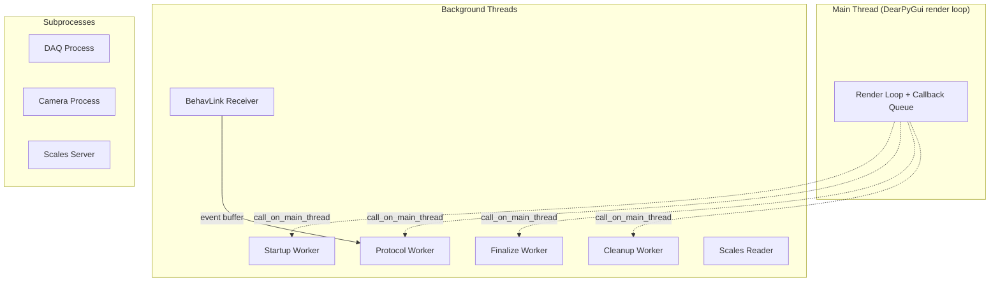

# Threading Model

The system uses multiple threads to keep the GUI responsive while running blocking operations. This page documents every thread, why it exists, and how they communicate safely.

## Thread inventory



Each lifecycle worker is **short-lived** and does **one phase only**. When its phase finishes, the worker emits a single `*_complete` event and exits. The GUI listener for that event triggers the next phase by calling the next public method on the controller, which spawns the next worker.

### Main thread

**Owner:** DearPyGui manual render loop (`dpg_app.py`)

**Responsibilities:**

- All GUI rendering and widget updates
- Draining the thread-safe callback queue each frame
- Running `FramePoller` tick for time-based polling (scales, clock, panel resize)
- User input handling

**Rule:** No blocking operations. No serial I/O. No subprocess management. Everything that blocks goes on a background thread.

### Thread-safe callback queue

The `call_on_main_thread(fn, **kwargs)` function appends to a `collections.deque` that is drained at the top of each render frame:

```python
# Any thread can call:
call_on_main_thread(self._on_protocol_log, message="Trial 1 complete")

# Render loop drains it:
while _callback_queue:
    fn, kwargs = _callback_queue.popleft()
    fn(**kwargs)
```

This replaces tkinter's `root.after(0, fn)` and is the **single marshalling point** for all cross-thread GUI updates.

### Frame-based polling

The `FramePoller` provides two mechanisms:

- `register(interval_ms, callback)` — recurring calls (e.g., scales at 100ms, clock at 1000ms)
- `call_later(delay_ms, callback)` — one-shot delayed execution (replaces `threading.Timer`)

The poller is ticked once per render frame. Callbacks fire when their interval has elapsed.

### Startup worker

**Created by:** `SessionController.start_session()`

**Lifetime:** From Start button click to startup complete/error/cancelled

**Does:**

- Opens serial ports
- Resets Arduino via DTR
- Launches DAQ, camera, scales subprocesses
- Performs BehavLink handshake
- Creates protocol and tracker instances

**Exits after emitting:** `_emit("startup_complete")`, `_emit("startup_error")`, or `_emit("startup_cancelled")`. Streams `_emit("startup_status")` while running.

### Protocol worker

**Created by:** `SessionController.run_protocol()` (called from the GUI's `_on_startup_complete` listener)

**Lifetime:** From startup complete to protocol finish

**Does:**

- Executes `protocol.run()` (`_setup` -> `_run_protocol` -> `_cleanup`)
- All trial logic, hardware commands, and performance recording
- Captures the final `ProtocolStatus`

**Exits after emitting:** `_emit("protocol_complete", final_status=...)`. Streams `protocol._emit("log")`, `tracker._emit("update")`, `tracker._emit("stimulus")` while running.

### Finalize worker

**Created by:** `SessionController.finalize_protocol()`

**Lifetime:** Brief -- result building only

**Does:**

- Gathers performance reports from every tracker group
- Saves the merged trial CSV to the session folder
- Builds the `SessionResult`

**Exits after emitting:** `_emit("finalize_complete", result=...)`.

### Cleanup worker

**Created by:** `SessionController.cleanup_session()`

**Lifetime:** Brief -- hardware shutdown only

**Does:**

- Sends `shutdown()` to BehaviourRigLink
- Closes serial port
- Stops PeripheralManager (DAQ, camera, scales)

**Exits after emitting:** `_emit("cleanup_complete")`. Streams `_emit("cleanup_log")` while running.

### BehavLink receiver thread

**Created by:** `BehaviourRigLink.start()`

**Lifetime:** From link start to link stop

**Does:**

- Continuously reads frames from the serial port
- Parses incoming messages (ACKs, sensor events, GPIO events)
- Places ACKs in a threading queue for command retry logic
- Places events in deque buffers for `wait_for_event()` to consume

**Named:** `"BehaviourRigReceiver"` (daemon thread)

### Scales reader thread

**Created by:** `Scales.start()` (inside the ScalesServer subprocess)

**Lifetime:** While scales are active

**Does:**

- Continuously reads from the serial port
- Parses wired/wireless messages
- Updates the cached weight value (thread-safe via lock)

## Thread safety mechanisms

### `call_on_main_thread()` — GUI marshalling

All controller events fire on background threads. The RigWindow wraps callbacks:

```python
def on_main_thread(fn):
    def wrapper(**kwargs):
        call_on_main_thread(fn, **kwargs)
    return wrapper
```

### Threading locks

| Lock | Location | Protects |
|------|----------|----------|
| Event buffer lock | BehaviourRigLink | Sensor/GPIO event deques |
| ACK queue lock | BehaviourRigLink | Command acknowledgement tracking |
| Weight lock | Scales | Cached weight value |
| State lock | VirtualRigState | All simulated hardware state |
| Dirty flag | VirtualRigState | Snapshot change tracking |

### Threading conditions

| Condition | Location | Purpose |
|-----------|----------|---------|
| Event condition | BehaviourRigLink | Wakes `wait_for_event()` when event arrives |
| Sensor inject condition | VirtualRigState | Wakes SimulatedRig when GUI injects events |
| Cue event | VirtualRigState | Wakes SimulatedMouse when LED/buzzer activates |

## Subprocess isolation

Three components run as separate **processes** (not threads):

| Process | Manager | Communication |
|---------|---------|---------------|
| DAQ acquisition | `DAQManager` | Signal files (filesystem) |
| Camera recording | `CameraManager` | Signal files + subprocess args |
| Scales server | `ScalesManager` | TCP sockets |

## Typical thread timeline

```
Time →

Main thread:     [Setup GUI] [Overlay] [Running Mode...........] [Post Mode]
Startup worker:  ............[startup]
Protocol worker: ........................[protocol.run.......]
Finalize worker: ............................................[fin]
Cleanup worker:  ...............................................[cleanup]
Receiver thread: ...........[serial read loop............................]
```
