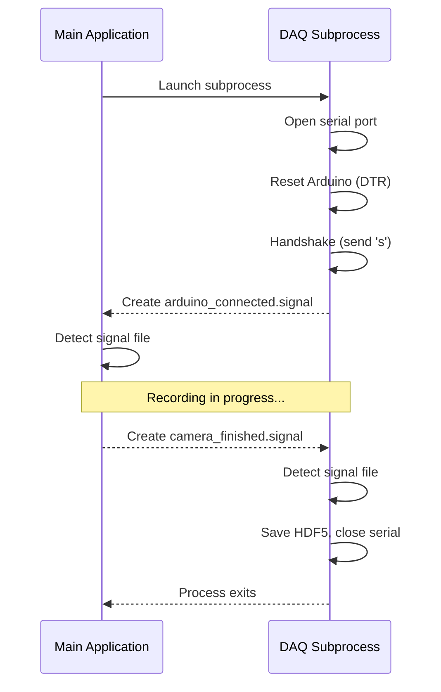

# DAQManager API

## Constructor

```python
DAQManager(
    mouse_id: str,
    date_time: str,
    session_folder: str,
    rig_number: int,
    daq_board_name: str = "",
    board_registry_path: str = "",
    connection_timeout: int = 30,
    log_callback: Optional[Callable[[str], None]] = None,
    simulate: bool = False,
)
```

| Parameter | Default | Description |
|-----------|---------|-------------|
| `mouse_id` | required | Mouse identifier for the session |
| `date_time` | required | Session timestamp string (YYMMDD_HHMMSS) |
| `session_folder` | required | Path to session output folder |
| `rig_number` | required | Rig number (1-4), used for signal file naming |
| `daq_board_name` | `""` | Board registry key (resolved to COM port at runtime) |
| `board_registry_path` | `""` | Path to `board_registry.json` |
| `connection_timeout` | `30` | Seconds to wait for Arduino connection |
| `log_callback` | `None` | Optional function for status messages |
| `simulate` | `False` | Skip subprocess and return success immediately |

## Methods

### `start() -> bool`

Launch the DAQ subprocess. Returns `True` if the subprocess started successfully.

The subprocess runs `serial_listen.py` with arguments for mouse ID, date/time, session folder, board port, and rig number.

### `wait_for_connection() -> bool`

Block until the DAQ subprocess signals that it has connected to the Arduino. Polls for the signal file at 0.5-second intervals up to `connection_timeout`.

Returns `True` when connected, `False` on timeout.

### `stop() -> None`

Stop the DAQ subprocess gracefully:

1. Create a stop signal file (`rig_N_camera_finished.signal`) in the session folder
2. Wait for the subprocess to exit (up to 10 seconds)
3. If still running, terminate the process
4. Clean up signal files

### `is_running -> bool`

Property that returns `True` if the subprocess is still alive.

### `last_error -> str`

Contains an error message if `start()` or `wait_for_connection()` failed.

## Signal file protocol

The DAQ subprocess coordinates with the main application through signal files in the session folder:

| Signal file | Created by | Purpose |
|-------------|-----------|---------|
| `rig_N_arduino_connected.signal` | Subprocess | Indicates successful Arduino connection |
| `rig_N_camera_finished.signal` | Main app | Tells subprocess to stop recording |

This file-based approach avoids IPC complexity and works reliably across processes.

### Sequence


