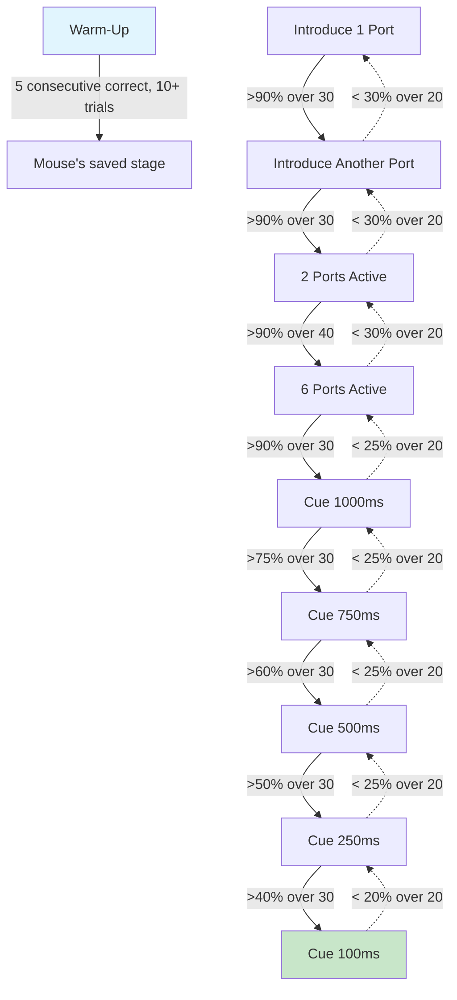

# Autotraining

The autotraining system automatically progresses mice through training stages based on their performance. Instead of manually deciding when a mouse is ready for the next phase, the system evaluates configurable transition rules after every trial and switches stages when conditions are met.

## Overview

The visual autotraining sequence has two phases: **port introduction** (learning to follow LED cues across increasing numbers of ports) and a **cue duration ladder** (responding to increasingly brief LED flashes).

Solid arrows are forward transitions (progression). Dashed arrows are regression transitions (falling back when performance drops).

## Key concepts

- **Stages** -- Named sets of parameter overrides that define how trials run during each phase of training
- **Transitions** -- Rules that move the mouse between stages based on performance metrics
- **Persistence** -- Training progress is saved between sessions so mice resume where they left off
- **Warm-up** -- Optional start-of-session stage to get the mouse engaged before resuming the real training stage

## Guides

- [Concepts](concepts.md) -- The mental model behind autotraining
- [Defining Stages](defining-stages.md) -- How to create stage definitions
- [Defining Transitions](defining-transitions.md) -- How to write transition rules
- [Persistence & Progress](persistence.md) -- How training state is saved and loaded
- [Creating a Custom Training Sequence](custom-sequence.md) -- End-to-end tutorial
