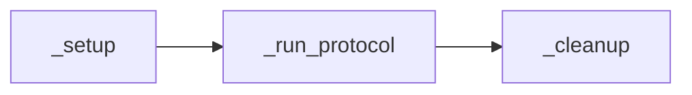

# Writing Protocols

Protocols are the core of the experiment system. Each protocol defines what happens during a behaviour session -- how trials are structured, what stimuli are presented, how responses are evaluated, and what data is collected.

## How protocols work

A protocol is a Python class that inherits from `BaseProtocol`. You implement a few required methods, and the system handles everything else: GUI parameter forms, session management, hardware startup/shutdown, data saving, and performance tracking.

### Protocol lifecycle



1. **`_setup()`** -- Optional initialization (called before the main loop)
2. **`_run_protocol()`** -- Your main experiment loop (required)
3. **`_cleanup()`** -- Optional teardown (always runs, even on error or stop)

Hardware shutdown is handled by the session controller after cleanup -- you don't need to close serial ports or stop subprocesses.

### Auto-discovery

The system automatically discovers protocols. Any Python file in the `protocols/` folder that contains a `BaseProtocol` subclass is loaded and shown as a tab in the GUI. Files starting with an underscore (like `_protocol_template.py`) are ignored.

No registration or import editing needed -- just drop a `.py` file in the folder.

## Required methods

Every protocol must implement these four class methods:

```python
from core.protocol_base import BaseProtocol

class MyProtocol(BaseProtocol):
    @classmethod
    def get_name(cls) -> str:
        """Display name shown in the GUI protocol tabs."""
        return "My Protocol"

    @classmethod
    def get_description(cls) -> str:
        """Description shown at the top of the protocol tab."""
        return "What this protocol does."

    @classmethod
    def get_parameters(cls) -> list:
        """List of configurable parameters (can be empty)."""
        return []

    def _run_protocol(self) -> None:
        """Main experiment loop."""
        pass
```

## Optional methods

```python
def _setup(self) -> None:
    """Called before _run_protocol. Override for initialization."""
    pass

def _cleanup(self) -> None:
    """Called after _run_protocol (always runs, even on error/stop)."""
    pass

@classmethod
def get_tracker_definitions(cls) -> list:
    """Declare named performance trackers for this protocol."""
    return []
```

## Available resources inside `_run_protocol()`

| Resource | Description |
|----------|-------------|
| `self.parameters` | Dict of parameter values (already validated and type-converted) |
| `self.link` | `BehaviourRigLink` instance for hardware control |
| `self.scales` | Scales client for weight readings |
| `self.perf_trackers` | Dict of named `PerformanceTracker` instances |
| `self.reward_durations` | List of 6 ints -- per-port reward pulse duration (ms) |
| `self.rig_number` | Which rig this session is running on |

## Key methods inside `_run_protocol()`

| Method | Description |
|--------|-------------|
| `self.check_stop()` | Returns `True` if the user clicked Stop. Check regularly and return early |
| `self.log(message)` | Send a message to the GUI session log |
| `self.sleep(seconds)` | Sleep (respects virtual clock in simulation) |
| `self.now()` | Current time in seconds (respects virtual clock in simulation) |

## Guides

- [Protocol Template](template-walkthrough.md) -- Line-by-line walkthrough of the template file
- [Parameter Types](parameter-types.md) -- Reference for all parameter types
- [Performance Trackers](performance-trackers.md) -- Declaring and using trial outcome tracking
- [Using BehavLink in Protocols](using-behavlink.md) -- Controlling hardware from your protocol
- [Full Example Protocol](full-example.md) -- Annotated walkthrough of a production protocol
